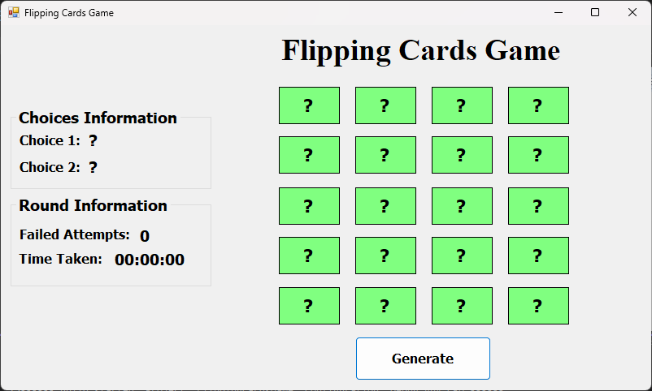
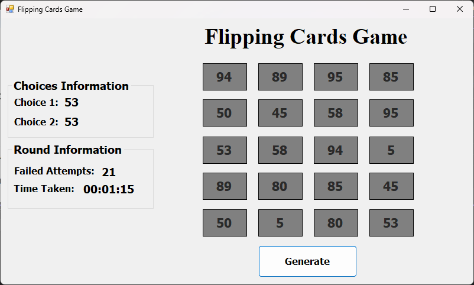

# Flipping Cards Game

Flipping Cards Game is a simple memory game developed using C# and Windows Forms. The objective of the game is to find all matching pairs of cards with as few failed attempts and in the shortest time possible.

## Features

- 20 cards displayed as buttons with hidden values
- Values are assigned in random pairs
- User flips two cards at a time to try and find matches
- Tracks number of failed attempts
- Tracks time taken for each round
- Displays message upon successful completion

## Screenshots

### Before Starting the Game

### After Finishing the Game

## How to Play

1. Click the **Generate** button to start a new game round.
2. Click on two cards to flip them and see if they match.
3. If they match, they remain revealed. If not, they will flip back.
4. The game ends when all cards are matched.
5. Your score is based on the number of failed attempts and total time.

## Setup and Requirements

- Developed with Visual Studio
- Windows Forms App (.NET Framework)
- .NET Framework 4.x or later

---

🎓 *This project is created for educational purposes to practice building desktop applications using C#.*