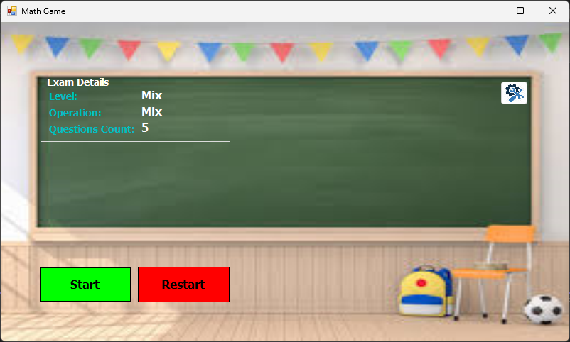
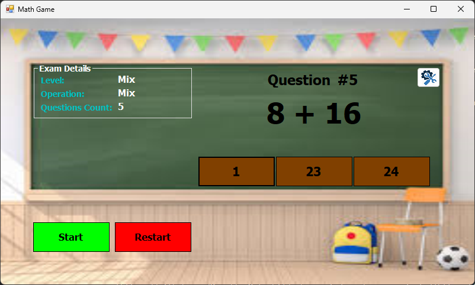
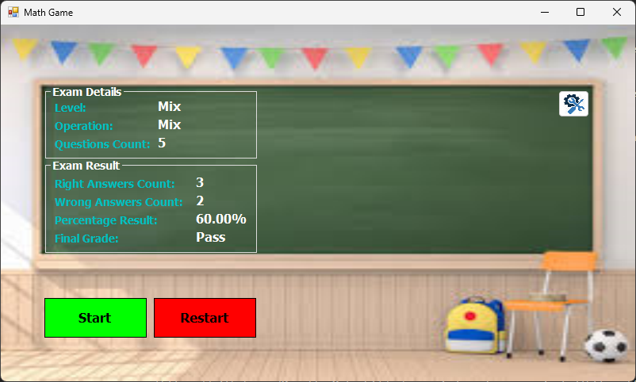
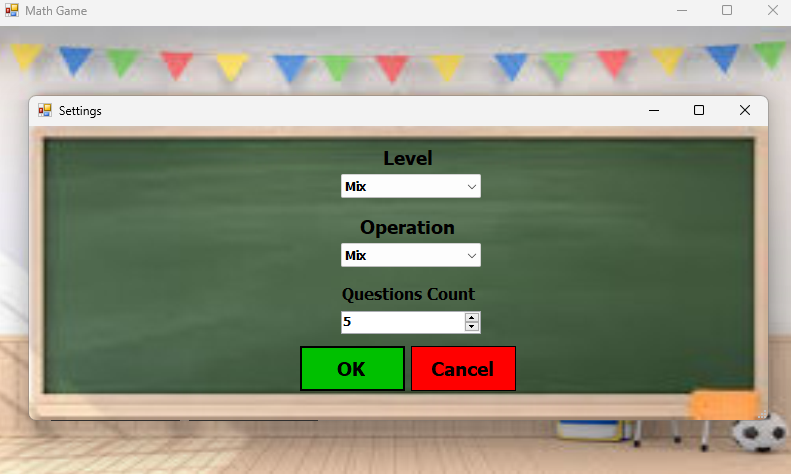

# Math Game - Windows Forms (C#)

An interactive math quiz application built with **C# Windows Forms** on the **.NET Framework**.  
This project allows users to test their arithmetic skills through randomly generated math questions with increasing difficulty. Designed following clean architecture principles and OOP best practices.

## 🧠 Project Structure & Design

The project is **logically divided into layers** to maintain separation of concerns:

### 1️⃣ Business Layer

- **`Exam` Class**: Core engine of the game responsible for managing the quiz session.
- **`Question` Inner Class**: Encapsulates individual math questions, their generation, and validation logic.

These classes handle all the quiz logic, including question generation, answer checking, scoring, and difficulty adjustments.

### 2️⃣ Screens Layer (UI Layer)

- Built with Windows Forms.
- Handles only the UI logic: start screen, question display, result screen, etc.
- All user interactions are captured and processed using public methods from the business layer.

## 🧩 Object-Oriented Design Principles Used

- **Encapsulation**: All logic is kept private inside classes unless required by the UI.
- **Abstraction**: Users interact with high-level methods like `StartExam()` and `GetNextQuestion()` without knowing the internal logic.
- **Single Responsibility Principle (SRP)**: Each class has a single, well-defined responsibility.
- **DRY Principle (Don't Repeat Yourself)**: Common logic is reused and abstracted properly.
- **Clean Code & Readability**: Code is modular, well-named, and easy to follow.

## 🌟 Features

- Randomly generated math questions (addition, subtraction, multiplication, etc.).
- Configurable number of questions per session.
- Tracks correct and incorrect answers.
- Displays final results and summary at the end.
- Responsive and intuitive user interface.
- Clean architecture that separates logic from UI, making it easy to extend or modify.

## 📷 Screenshots

### ⏳ Before Starting the Game
 <!-- Replace with actual path -->

### 🎮 During the Game (Answering Questions)
 <!-- Replace with actual path -->

### 🏁 After Finishing the Game (Results Screen)
 <!-- Replace with actual path -->

### 🛠️ (Settings Screen)
 <!-- Replace with actual path -->

---

## 🛠️ Requirements

- Windows OS with .NET Framework.
- Visual Studio (2019 or later) with Windows Forms support.

## 🚀 How to Run

1. Clone or download the project.
2. Open the `.sln` file in Visual Studio.
3. Build and run the solution.
4. Follow the on-screen instructions to start the quiz.

## 📁 Repository

Part of the **Windows Forms Projects Series** on GitHub:  
[https://github.com/MozaffarMotwakil/csharp-windows-forms-projects](https://github.com/MozaffarMotwakil/csharp-windows-forms-projects)

---

🎯 *This project demonstrates the application of OOP principles in real-world educational applications.*
