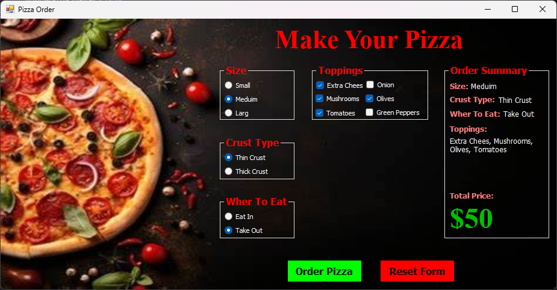
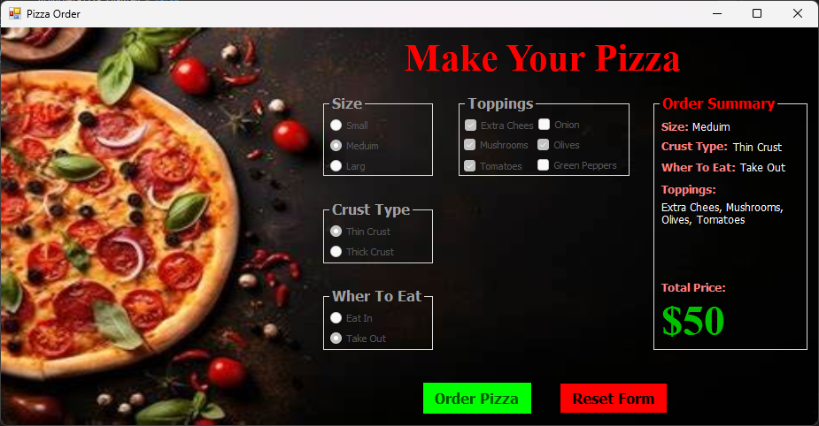

# Pizza Order App - Windows Forms (C#)

A simple desktop application for ordering pizza, developed using **C# Windows Forms** on the **.NET Framework**.  
This project simulates a pizza order form where users can select their pizza options and place an order with a click.

## 🍕 Features

- Choose from different pizza types and sizes.
- Add extra toppings with checkboxes.
- Order summary displayed upon submission.
- Submit button disables after order is placed (to simulate order processing).
- Clean and intuitive UI design using Windows Forms.

## 📷 Screenshots

### 📝 Before Order (Selection Screen)

### ✅ After Order (Confirmation & Disabled Buttons)

## 🛠️ Requirements

- Windows OS with .NET Framework.
- Visual Studio (2019 or later) with Windows Forms support.

## 🚀 How to Run

1. Clone or download the project.
2. Open the `.sln` file in Visual Studio.
3. Build the solution.
4. Run the project and interact with the UI.

---

🎯 *This project is intended for educational purposes to practice GUI development with C#.*
