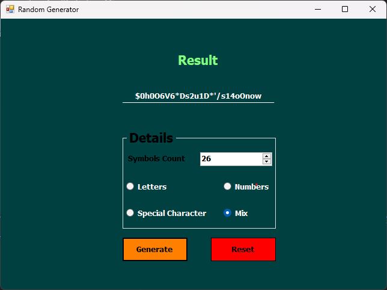

# Random Generator - Windows Forms (C#)

A simple and useful Windows Forms application that generates random numbers and random strings based on user-defined settings. Designed for quick testing, educational purposes, and utility use.

## 🧱 Project Structure

The project follows a flat and clean Windows Forms structure for quick deployment and comprehension.

### 📂 Forms

- **`frmMain.cs`**: The main form that contains all the UI elements.
- **Random Number Section**:
  - Allows user to define a minimum and maximum value.
  - Generates one or multiple random numbers.
- **Random String Section**:
  - Supports generating random strings with specific length and character options (letters, digits, symbols).

All logic for random generation is handled directly in the form, with proper validation and user control.

## 🔧 Features

- 🔢 **Random Number Generator**:
  - Specify a numeric range (min & max).
  - Choose how many numbers to generate.
- 🔡 **Random String Generator**:
  - Choose the length of the string.
  - Select from lowercase, uppercase, digits, and symbols.
- 🧪 **Multiple Generation**: Generate multiple values at once.
- 📋 **Copy Button**: Copy results directly to clipboard.
- ✅ **Input Validation**: Prevents invalid entries (e.g., min > max).
- 🎯 **User-Friendly Interface**: Organized, clear, and responsive design.

## 🧩 Principles & Practices

- **Encapsulation**: UI and logic are kept together but modular enough for easy maintenance.
- **Single Responsibility**: Each section of the form is responsible for a specific type of generation.
- **Clean UI Code**: Optimized for readability and reusability.

## 📷 Screenshot

### 🎲 Random Generator Interface
 <!-- Replace with actual image path -->

## 🚀 How to Run

1. Clone or download the repository.
2. Open the `.sln` file using Visual Studio.
3. Build and run the solution.
4. Use the interface to generate random numbers or strings based on your input.

## 📁 Repository

This project is part of the **C# Windows Forms Projects Series**:  
[https://github.com/MozaffarMotwakil/csharp-windows-forms-projects](https://github.com/MozaffarMotwakil/csharp-windows-forms-projects)

---

🎲 *Perfect for experimenting with randomness and understanding C#'s `Random` class in a visual way.*
