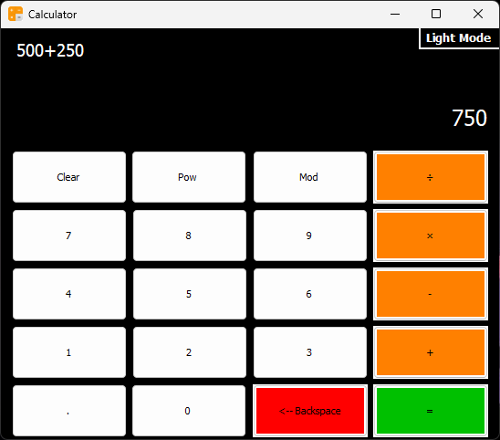
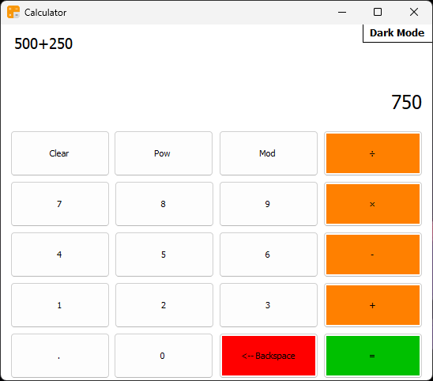

# Simple Calculator - Windows Forms (C#)

A basic calculator application built using **C# Windows Forms** on the **.NET Framework**.  
This project demonstrates the creation of a simple GUI-based calculator that performs basic arithmetic operations with a clean and responsive interface.

## ✨ Features

- 🧮 Perform basic operations: Addition, Subtraction, Multiplication, Division.
- 🌓 Supports Light and Dark Modes (UI variations).
- 👨‍💻 Built using Windows Forms Designer with clean and intuitive layout.
- 💡 A great starting point for beginners learning C# GUI development.

## 📷 Screenshots

### 🌙 Dark Mode

### ☀️ Light Mode

## 🛠️ Requirements

- Windows OS with .NET Framework installed.
- Visual Studio (2019 or later) with Windows Forms support.
- Basic knowledge of C# and event-driven programming.

## 🚀 How to Run

1. Clone the repository or download the project folder.
2. Open the `.sln` file in Visual Studio.
3. Build the solution (`Ctrl + Shift + B`).
4. Run the project (`F5` or click "Start").

## 📁 Repository

Part of the **Windows Forms Projects Series** available here:  
[https://github.com/MozaffarMotwakil/csharp-windows-forms-projects](https://github.com/MozaffarMotwakil/csharp-windows-forms-projects)

---

🎓 *This project is created for educational purposes to practice building desktop applications using C#.*
