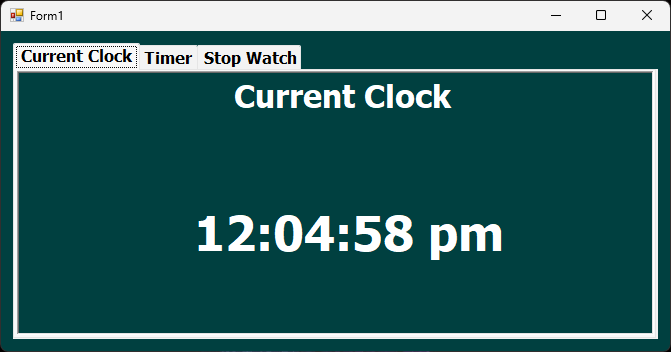
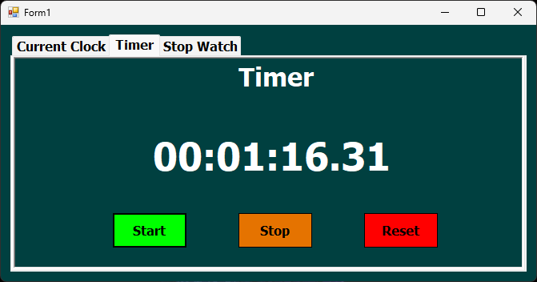
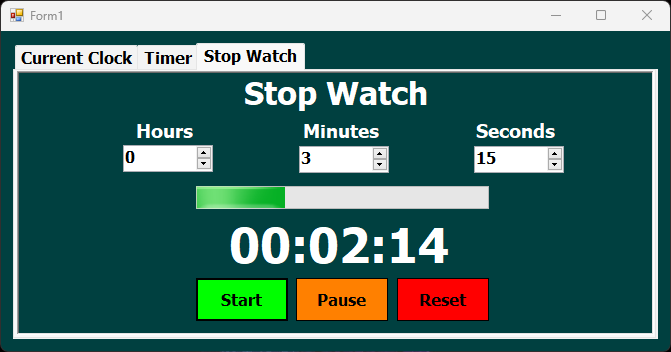

# Timer Utility - Windows Forms (C#)

A Windows Forms application built in C# that provides multiple time-related utilities. The application includes a **Current Clock**, a **Countdown Timer**, and a **Stopwatch** – all organized in an intuitive and responsive user interface.

## 🧱 Project Structure

The project is structured with simplicity and clarity in mind. It follows a flat structure for form screens while keeping each feature modular.

### 📂 Forms

- **`frmMain.cs`**: The main entry point containing tabs for the three utilities (Clock, Timer, and Stopwatch).
- **`tabClock`**: Displays the real-time system clock and updates every second.
- **`tabCountdownTimer`**: Allows the user to set a countdown timer with custom input and start/stop control.
- **`tabStopwatch`**: A fully functional stopwatch with start, stop, and reset capabilities.

Each feature is separated into its own UI component (Tab Page), and leverages a `Timer` control for real-time updates and countdown functionality.

## 🔧 Features

- 🕒 **Live Clock**: Displays the current system time and updates every second.
- ⏳ **Countdown Timer**: Set a specific time duration and count down to zero with clear controls.
- ⏱️ **Stopwatch**: Tracks elapsed time with start, pause, and reset options.
- 🎯 Simple and clean user interface.
- 💡 Utilizes Windows Forms `Timer` component for smooth timing operations.
- 🔒 Input validation for countdown setup.

## 🧩 Principles & Practices

- **Encapsulation**: Logic for timing and updates is separated from UI interaction where possible.
- **Single Responsibility Principle (SRP)**: Each tab serves a single purpose.
- **DRY Principle**: Common logic is reused and kept clean.
- **Readable UI Code**: Organized and easy to follow for educational and modification purposes.

## 📷 Screenshots

### 🕰️ Current Time Tab
 <!-- Replace with actual image path -->

### ⏳ Countdown Timer Tab
 <!-- Replace with actual image path -->

### ⏱️ Stopwatch Tab
 <!-- Replace with actual image path -->

## 🚀 How to Run

1. Clone or download the repository.
2. Open the `.sln` file in Visual Studio.
3. Build and run the solution.
4. Navigate between tabs to explore each utility.

## 📁 Repository

This project is part of the **C# Windows Forms Projects Series**:  
[https://github.com/MozaffarMotwakil/csharp-windows-forms-projects](https://github.com/MozaffarMotwakil/csharp-windows-forms-projects)

---

🎯 *Perfect for beginners exploring timers, events, and real-time UI updates in Windows Forms.*
